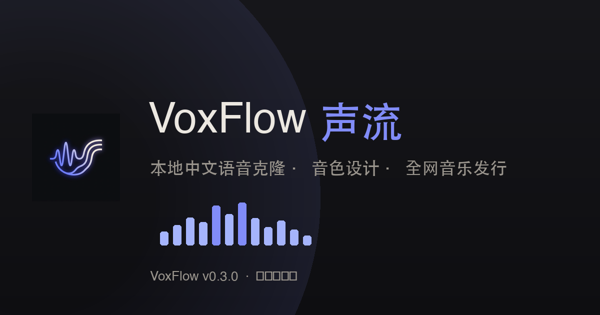
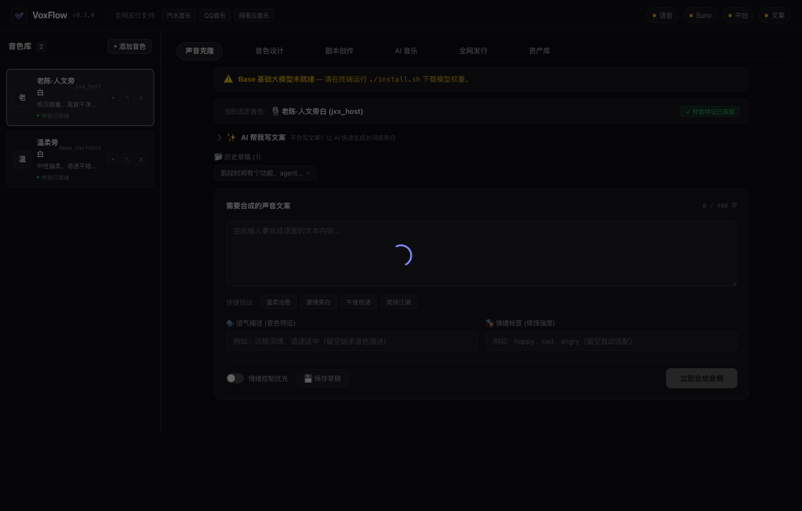

<p align="center">
  
</p>

<h1 align="center">VoxFlow 声流</h1>

<p align="center">
  
  
  
  
  
  
</p>

<p align="center">
  <b>Local-first Chinese voice cloning, voice design, and full-net music distribution workbench.</b>
  <br />
  One command to synthesize audio — <b>no network, no commercial API key, private audio never leaves the machine</b>.
  <br />
  For creators, independent musicians, and AI / Agent automation workflows.
</p>

[中文](./README.md) · [Quick start](#-quick-start) · [Core commands](#-core-capabilities--commands) · [TTS backend](#-local-tts-backend-apple-mlx-8-bit) · [Web workbench](#-web-ui-workbench) · [Distribution](#-full-net-music-distribution) · [Agent calls](#-agent--ai-automation)

<p align="center">
  
</p>

---

## ⚖️ Core advantages & comparison

| Feature | ElevenLabs / commercial cloud | JianYing TTS / online platforms | **VoxFlow** |
|---|:---:|:---:|:---:|
| **Audio privacy** | ❌ Must upload to cloud | ❌ Depends on platform servers | 🛡️ **Fully local, never leaves machine** |
| **Voice cloning** | ⚠️ Monthly subscription / per-call billing | ❌ No custom voices | ✅ **5–10 second sample, instant clone** |
| **Text-described voice creation** | ⚠️ Limited | ❌ Not supported | 🎨 **No reference needed, prompt-only synthesis** |
| **Long-term cost** | 💸 Per-token / per-character continuous billing | 🔒 Locked to specific ecosystem | 🎁 **One deploy, forever free** |
| **Full-net distribution** | ❌ Manual distribution | ❌ Only built-in channels | 🚀 **Qishui Music / QQ Music / NetEase Cloud Music distribution ledger** |
| **Dev & automation** | ✅ REST API | ❌ Closed GUI | ⚡ **Unified CLI + FastAPI backend + Agent Skill** |
| **Cost & ROI visible** | ❌ Just a total bill | ❌ None | 📊 **Per-track cost · payback plays · measured ¥/1000-play** |

---

## 🚀 Quick start

### 1. Install dependencies (~2 min)

```bash
git clone https://github.com/webkubor/voxflow.git
cd voxflow

# --skip-models: don't download the 5.8 GB model yet; you can start immediately
chmod +x install.sh && ./install.sh --skip-models

source .venv/bin/activate
voice doctor            # environment self-check
```

### 2. Open the workbench, download model while using

```bash
voice web
# → browser at http://localhost:8866
```

**Don't wait for the model download to start.** Local TTS weights are 5.8 GB (MLX 8-bit), but **most of VoxFlow doesn't touch the local model**:

| Immediately usable (zero download) | Needs Base model (2.9 GB) | Needs VoiceDesign (2.9 GB) |
|---|---|---|
| AI music (Suno) | Voice cloning | One-prompt voice creation |
| Work board / full-net distribution ledger | Multi-character script synthesis | |
| Ops (cost / health / logs) | | |

So the first screen **lands on what the current capability supports**: when the model isn't downloaded, it goes to "AI Music" instead of a screen of grey buttons. Want cloning? Tap in, that screen has a card that **starts downloading in place** (background, page close doesn't interrupt), with a list of what's still usable in the meantime.

Or install everything up front:

```bash
./install.sh                        # interactive, asks about VoiceDesign
./install.sh --yes                  # non-interactive, downloads both models (CI / Agent)
./install.sh --yes --skip-voice-design   # only Base, save 2.9 GB
```

> Models land in **`~/.voxflow/models-mlx/`** (data dir), not the project dir — reinstall tools, switch branches, `git clean`, none of them will make you re-download 5.8 GB.
>
> Pre-2026-09-14 downloads were Qwen native PyTorch weights (`~/.voxflow/models/`, 8.4 GB). No code reads those anymore; they're kept only for rollback. Once MLX is confirmed stable, feel free to delete and reclaim space.

---

## ⚡ Core capabilities & commands

VoxFlow ships a modern Typer CLI toolchain for the full local audio pipeline:

### 🎙️ 1. Voice Clone

Use an existing voice persona to synthesize script text. Output lands in `out/` under the data dir:

```bash
# Basic clone: voice comes from this persona's reference audio in personas.json
voice clone narrator "Frost-tipped leaves outshine February blooms, mountain hues blur in misty rain"
```

> **⚠️ `--tone` / `--emotion` does NOT take effect on the clone path.** The MLX Base model has no dynamic emotion instruction entry at the source level (PyTorch-era `instruct_ids` was actually effective; the migration has no equivalent). To carry emotion, **write it into the text itself** ("he roared furiously: …"), or switch to **Voice Design** below — it uses VoiceDesign and natively supports instructions.
> When you pass `--tone`, the CLI explicitly tells you "this run won't take effect", not silently dropping it.

### 🎨 2. Voice Design

**No reference audio needed** — create a dedicated voice purely from natural language description:

```bash
# Design a new voice from text and register it
voice design sword_master "Ten steps, one life; a thousand miles, no one left behind." --tone "Gruff and bold jianghu wanderer, steady and dignified"
```

### 📜 3. Multi-character Dialogue

Synthesize a complete dialogue track in one batch from a script config:

```bash
voice dialogue configs/dialogue.json
```

### 📦 4. Voice Asset Management

```bash
voice voice list                        # list all locally registered voices
voice voice add my_voice sample.wav     # register a new voice from a reference
voice voice preview narrator            # preview a preset voice's sample
voice voice rm old_voice                # remove a voice
```

### 📊 5. Cost & Runtime Status

```bash
voice stats                    # last 30 days: where the money went, how much local saved
voice stats --tracks           # per-track: each song's cost + payback play count
voice stats --json             # structured output, for agents to decide "keep going?"
voice logs --level error       # only failed calls (failures still consume upstream credits)
```

---

## 🧠 Local TTS backend: Apple MLX 8-bit

VoxFlow's TTS moved from PyTorch (MPS) to **Apple MLX** on **2026-09-14**, with the model swapped to `mlx-community`'s 8-bit quantized version. This isn't "switching libraries" — it architecturally eliminated a class of silent failures.

### Measured gains

| Metric | PyTorch + MPS (before migration) | Apple MLX 8-bit (now) | Change |
|---|---|---|---|
| Model size (Base + VoiceDesign) | 8.4 GB | **5.8 GB** | ⬇ **−31%** |
| Single inference | 9.32 s | **5.29 s** | ⬆ **1.76× faster** |
| Output duration (same text, same voice) | 4.64 s | 4.56 s | Same |
| Audio quality (whisper transcribe round-trip) | Exact match | Exact match | **No loss** |
| Peak memory | — | 6.97 GB (measured) | — |
| Model load | 14.44 s | 6.55 s cold / 5.74 s hot | First cold read skews slower |

**The speed isn't because "MLX is naturally fast".** The PyTorch version only ran because of one line: `PYTORCH_ENABLE_MPS_FALLBACK=1` — MPS-unsupported ops **silently fall back to CPU**, and you have to shuttle tensors back and forth, wasting "unified memory" at exactly that step, invisible from outside. MLX has no fallback: either full Metal GPU or error, **silent degradation doesn't exist**. That's the real gain from migration; the 31% size reduction is a bonus.

### Voice fidelity: neither worse, nor better

Using Qwen3-TTS's built-in speaker encoder (x-vector) to compute cosine similarity, **with a negative control** (a different voice as lower bound) and **noise floor measurement** (same backend, different seeds, see how much similarity jitters on its own):

| Subject | Cosine similarity with original voice |
|---|---|
| Reference audio self-comparison (upper bound) | 1.0000 |
| PyTorch seed 42 / 43 / 44 | 0.9931 / 0.9928 / 0.9925 |
| MLX | 0.9934 |
| Negative control · different voice (lower bound) | 0.9425 |

PyTorch's three-seed range (**noise floor**) = 0.0006, MLX vs. PyTorch mean delta = **+0.0006** — exactly on the noise floor. **So migration is neither loss nor gain on the voice side** — don't use it as a justification. Reproduction script: [`tools/compare_voice_fidelity.py`](tools/compare_voice_fidelity.py).

### Two must-know limitations

**1. Clone path has no dynamic emotion instruction.** The MLX Base model has no `instruct` entry at the source level (the `_generate_icl()` signature doesn't include it). But the PyTorch-era `instruct_ids` was **actually effective** — controlled-variable measurement (fixed seed, only this parameter changed) showed outputs diverging completely: F0 coefficient of variation +33.9%, F0 dynamic amplitude +49.9%, energy dynamic amplitude +136.5% — exactly the acoustic features of emotion arousal. So this is **a net loss**, not "was never useful". Workaround: put emotion in the text, or use VoiceDesign. Reproduction script: [`tools/verify_instruct_effect.py`](tools/verify_instruct_effect.py).

**2. `ref_text` is required.** When cloning, the text corresponding to the reference audio must be filled in the persona's `ref_text` field in `personas.json` — leaving it empty causes **truncation + garbled output**:

| `ref_text` | Output duration | Whisper transcribe |
|---|---|---|
| `""` (wrong) | 2.08 s (truncated) | "This is a voice sample test run, see..." ❌ |
| Real text (correct) | 4.56 s | "This is a voice synthesis test, to verify the model works." ✅ |

Missing this field, the CLI errors directly and tells you which file to whisper-transcribe — won't leave you with a garbled clip.

### Hardware requirements

**Apple Silicon (M-series) + macOS, no exceptions.** The PyTorch fallback path has been entirely removed (keeping it = maintaining two implementations, A/B testing each time you change code). `voice doctor` returns **FAIL** (not WARN) on non-Apple Silicon — "can't use" should never be written as "almost".

Decision process, capability matrix, complete change list and rollback method: [docs/MLX_MIGRATION.md](docs/MLX_MIGRATION.md).

---

## 🖥 Web UI Workbench

VoxFlow includes a high-contrast, clean dark modern audio creation interface:

<p align="center">
  
</p>

- **Voice Workshop** — left-side unified management of all loaded voice artists, with quick waveform preview and sample status
- **Creation Console** — quick atmosphere presets (gentle / passionate / midnight-whisper / wuxia), emotion priority control and drafts
- **Full-net Distribution Hub** — direct to **Qishui Music, QQ Music, NetEase Cloud Music** distribution ledger; manages artist profiles, song ID mapping, platform metadata
- **Media Library** — one-click online preview, waveform view, batch physical download of historical audio
- **Fully Custom Pure Player** — strips native browser controls; offers fine-grained time track, precise drag positioning, lossless playback
- **Ops Console** — cost / revenue / system health / runtime logs in one place (see next section)

---

## 📊 Ops console: the actual business math

Most AI creation tools only tell you "generation succeeded". VoxFlow also tells you **how much this generation cost, how many plays before payback, by today whether it's in the green or red**.

Visit `http://localhost:8866/#/ops`, or run `voice stats`.

### Cost side: three chains, one ledger

| Source | Billing | How it appears in the ledger |
|---|---|---|
| Local TTS (Qwen3-TTS) | Free | Actual ¥0 always; also calculates "the same volume via commercial API would cost X" |
| Suno AI music | Subscription credits | Credits per generation × current unit price |
| museav platform (image / copy) | Prepaid credits | Metered by token / image; authorize via `voice museav login`, charged to **your own account** |

Two details easy to overlook but explicitly handled here:

- **Failed calls get logged too.** Suno failures still consume credits; only logging successes means the ledger can never balance, and "failure rate × unit price" is precisely the waste that needs to be visible.
- **Costs are stamped at the current unit price when written.** Plan changes, platform repricing — none of them retroactively rewrites history — otherwise one reprice changes the whole past half-year.

Unit price table at [`configs/pricing.json`](configs/pricing.json) — copy to `~/.voxflow/configs/` to override; upgrades won't clobber your override.

### Revenue side: measured data drives actual split rate

The platform backend gives both cumulative plays and withdrawable amount — divide and you have **the actual ¥/1000-plays this account receives** — more accurate than any public data, because it includes actual rights tiers.

The UI explicitly marks each rate as "measured" or "estimated". Platforms with no first-hand split-rate data (e.g. Tencent's stack) — better to leave blank than fill in a guess — guesses become decisions.

### Per-track: which song is making money

Account-level totals can't answer "what style should the next song be". Per-track plays aren't available via public API (NetEase Cloud's `song/detail` `playedNum` is always 0, measured), only from the artist backend:

```bash
VF_BASE=$PWD browser-harness < scripts/ncm_stats.py         # account-level: total plays / followers / earnings
VF_BASE=$PWD browser-harness < scripts/ncm_track_stats.py   # track-level: last 30 days plays
```

The ops workbench's work table then gives each song: **cost · last-30-day plays · estimated revenue · ROI · plays to payback**.

Two stated conventions:

- **Plays are last 30 days, not cumulative.** The backend only gives 7-day / 30-day buckets; cumulative is mostly old-song sediment — "which songs are growing in the last 30 days" is the actionable signal.
- **Per-track revenue is estimated.** The backend has no per-track revenue column, so it's calculated as `plays × measured ¥/1000-plays`. NetEase pays by play, per-account rates are roughly the same, the estimate holds — but it's not platform-actual; the UI marks it, don't use it for accounting.

A "—" in the table means **no data**, not 0. The two are very different meanings: the former is "not yet fetched", the latter is "really zero plays".

### System health: not ping, checkup

`/api/health` checks: can the DB read, can the data dir write, how much disk left, has the model finished downloading, is the task queue blocked — returns `ok` / `degraded` / `down`.

`degraded` is the most useful of the three — "can still make songs but space is almost gone". With only ok/down, `degraded` counts as ok, and by the time you notice it's down.

```bash
curl -s localhost:8866/api/health | jq .status     # for monitoring / agents
curl -s localhost:8866/api/metrics | jq .routes    # per-endpoint volume, error rate, P50/P95
```

---

## 🌐 Full-net Music Distribution

VoxFlow isn't just a TTS engine — it's a **music and audio distribution management hub** for independent creators:

- **Artist identity ledger** (`configs/artist.json`): unified maintenance of public stage names, real-name copyright entities, each platform's home + artist ID
- **Multi-platform data alignment**: auto-parses and verifies Qishui Music / QQ Music / NetEase Cloud Music catalog IDs and play links
- **Standard distribution spec**: one-click packaging of audio + cover + lyrics meta asset bundles, aligned with each distribution channel's spec

---

## 🤖 Agent / AI Automation

VoxFlow is designed for automation agents from the start:

### 1. Non-interactive deployment (CI/CD)

```bash
./install.sh --yes                      # fully automatic: deps + Base + VoiceDesign models
./install.sh --yes --skip-voice-design  # only deps and Base (save 2.9 GB)
```

### 2. Environment diagnosis & health

```bash
voice doctor           # terminal table report
voice doctor --json    # JSON output for agent decision parsing
```

---

## 📁 Project architecture

```
voxflow/
├── cli/            # Typer CLI entry (clone / design / dialogue / web / doctor etc.)
├── core/           # Core engine (cloner / prompt design / database / pipeline distribution / metering obs.py)
│   ├── paths.py    # Path source of truth — code location, data location, defined once for the whole project
│   └── engine.py   # Qwen3-TTS engine (Apple MLX 8-bit, see docs/MLX_MIGRATION.md)
├── web/            # FastAPI backend routes + static serving
│   ├── app.py      # RESTful API endpoints (synth, voice, artist profile, task queue, health/metrics/cost)
│   └── ui/         # Vue 3 + Pinia + Vite modern pure-black workbench frontend source
├── configs/        # Platform SOP, pricing.json, initial config
├── tools/          # One-shot verification scripts (MLX smoke / PyTorch baseline / voice fidelity / memory probe)
├── docs/           # Doc index in docs/README.md
├── tests/          # Metering logic self-check (no framework, just `python tests/test_obs.py`)
└── assets/         # Brand icons + official workbench screenshots
```

---

## 📄 License

This project is open-sourced under **Apache-2.0**.

Underlying voice modeling based on Qwen3-TTS heavily customized; inference weights use [mlx-community](https://huggingface.co/mlx-community)'s 12Hz-1.7B 8-bit quantization.

> ⚠️ **Verify-first policy** (per CLAUDE.md): commands that consume real credits (`suno generate`, `museav gen`, LLM token-spending endpoints) require explicit user confirmation. Free endpoints (`suno list` / `credits` / `status`, `voice doctor`, `/api/health`) are safe to run any time. Functional verification should use parameter validation, read-only endpoints, dry-run, and code-path inspection first — only ask to spend credits when no other path exists.