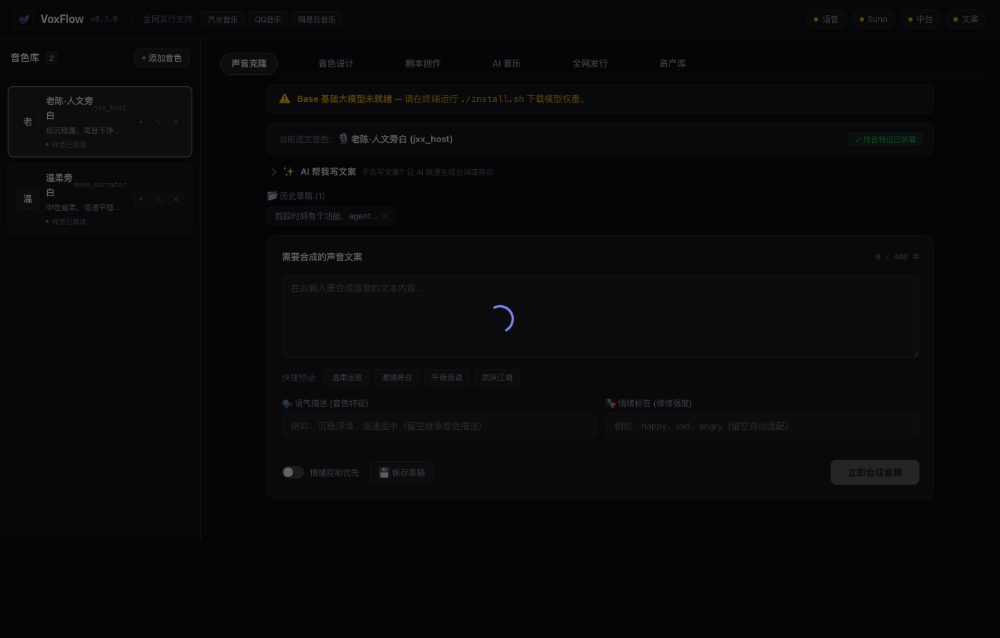
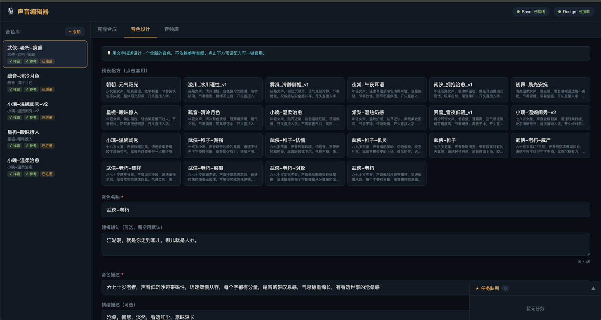

<p align="center">
  
</p>

<h1 align="center">VoxFlow 声流</h1>

<p align="center">
  
  
  
  
  
  
</p>

<p align="center">
  <b>本地运行的中文语音克隆 + 音色设计工具台。</b>
  <br />
  一条命令出音频，<b>不联网、不要 API Key、音频永不上传</b>。
  <br />
  给人用，也给 AI / Agent 直接调用。
</p>

<p align="center">
  <a href="#-一分钟装好"><strong>装</strong></a> ·
  <a href="#-和其它方案的区别"><strong>差异对比</strong></a> ·
  <a href="#-三种核心模式"><strong>核心模式</strong></a> ·
  <a href="#-给-ai--agent-调用"><strong>Agent 调用</strong></a> ·
  <a href="README_EN.md"><strong>English</strong></a>
</p>

<p align="center">
  
</p>

---

## ⚖️ 和其它方案的区别

| | ElevenLabs | 云 TTS（阿里/腾讯/Azure） | 剪映配音 | **VoxFlow** |
|---|:---:|:---:|:---:|:---:|
| 音频上传服务器 | ✅ 要 | ✅ 要 | ✅ 要 | ❌ **全程本地** |
| 声音克隆 | ✅ | ⚠️ 多需企业认证 | ❌ | ✅ 一段样音即可 |
| **文字描述造音色** | ⚠️ 有限 | ❌ | ❌ | ✅ **不需要任何参考音频** |
| 按量计费 | ✅ | ✅ | 免费但限平台内 | ❌ **一次装好，之后免费** |
| 可脚本化 / Agent 调用 | ✅ API | ✅ API | ❌ | ✅ CLI + HTTP API |
| 中文表现 | 良 | 优 | 优 | 优（Qwen3-TTS） |
| 前置成本 | 注册 + 付费 | 注册 + 实名 | 装客户端 | **下 4.2GB 模型** |

**最实在的差异是第一行**：克隆真人声音时，样音要不要交给别人的服务器。
做 IP 角色音、给客户配音、处理未公开的素材时，这条往往不是偏好问题而是合规问题。

**第三行是能力上的差异**：VoiceDesign 能用「低沉沙哑的中年男声」这样一句话凭空造出音色，
不需要任何参考音频 —— 想要一个不存在的人的声音时，只有这条路。

> 换个角度：如果你只是偶尔配几句、不在乎音频上传，云服务更省事。
> VoxFlow 的价值在**批量**（不计次收费）与**私密**（音频不出本机）这两件事上。

---

## 📦 一分钟装好

```bash
git clone https://github.com/webkubor/voxflow.git
cd voxflow
chmod +x install.sh && ./install.sh
source .venv/bin/activate
voice --help
```

脚本自动完成：创建 `.venv` → 安装依赖 → 下载基础模型。

---

## ⚡ 真实效果

```bash
# 克隆已有角色音色生成台词
voice clone narrator "霜叶红于二月花，山色空蒙雨亦奇"
# → out/narrator_20260421_143201.wav  [2.3s]

# 用文字描述设计新音色
voice design xiao_jing "这是一段建模短句" --tone "温柔、清晰、偏少女"
# → voice 'xiao_jing' saved to personas.json

# 多角色对白（配置驱动，暂无 CLI 子命令）
python main.py dialogue          # 读 configs/dialogue.json 里的 lines
# → out/ 下按行生成并合并

# 跑现成的武侠预设
voice preset list                # 看 configs/presets/ 里有哪些
voice preset run 武侠_老朽_江湖啊
```

---

## 🧩 当前能力

| 功能 | 状态 | 命令 / 入口 |
|:---|:---:|:---|
| 声音克隆（角色复用） | ✅ | `voice clone <persona> "台词"` / Web UI「克隆合成」 |
| 音色设计（文字描述） | ✅ | `voice design <name> "短句" --tone` / Web UI「音色设计」 |
| 多角色对话生成 | ⚠️ | 功能已实现（`core/modes/dialogue.py`），但**没有 CLI 子命令**；入口是 `python main.py dialogue`，读 `configs/dialogue.json` |
| 预设任务 | ✅ | `voice preset list` / `voice preset run <名>` |
| 音色列表管理 | ✅ | `voice voice list` |
| **Web UI** | ✅ | `voice web` → http://localhost:8866 |
| 文案库（持久化常用台词） | ✅ | Web UI「克隆合成」文案 chip 条 |
| 异步任务队列（进度可见） | ✅ | Web UI 右下角任务队列 |
| 模型状态与下载进度 | ✅ | Web UI 顶部状态栏 |
| 环境自检 | ✅ | `voice doctor`（含 FreeLLMAPI 检测） |
| Agent 无交互安装 | ✅ | `./install.sh --yes` |
| **AI 文案生成** | ✅ | `voice ai-script "描述"` / Web UI AI 助手 |
| **AI 文案润色** | ✅ | `voice ai-polish "文案"` / Web UI AI 助手 |

---

## 🖥 Web UI

```bash
voice web
# → http://localhost:8866
```

### 界面预览

<p align="center">
  
  <br/>
  
</p>

### 🎛 三种核心模式

| 模式 | 作用 | 典型流程 |
|:---|:---|:---|
| **音色库** | 管理已有音色 persona | 上传参考音频 → 自动注册命名 → 左侧点击试听 / 切换 |
| **克隆合成** | 用已有音色生成台词 | 选音色 → 输入 / 选择文案 → 异步合成 → 在线试听 / 下载 |
| **音色设计** | 用文字描述创造新音色 | 填音色名称、建模短句、音色描述 → 一键生成 → 入库复用 |

### 辅助模块

- **文案库**：常用台词保存在 `configs/scripts.json`，切换音色时文案不丢失，点击 chip 条一键载入。
- **音频库**：历史生成列表，支持播放、下载、删除。
- **任务队列**：合成 / 设计均为后台异步任务，带进度条，UI 不阻塞，可随时查看队列状态。
- **模型状态栏**：顶部实时显示 Base / VoiceDesign 模型下载状态（未下载 / 下载中 / 已就绪），模型未就绪时对应功能自动禁用。
- **AI 文案助手**：接入 [FreeLLMAPI](https://github.com/tashfeenahmed/freellmapi) 后，可在克隆合成 Tab 中用 AI 生成文案、润色已有文案。未接入时功能自动隐藏，不影响核心 TTS 流程。

### AI 文案助手（可选）

VoxFlow 支持接入 [FreeLLMAPI](https://github.com/tashfeenahmed/freellmapi) — 一个聚合 18 个免费 LLM 提供商的 OpenAI 兼容代理，实现 AI 文案生成与润色。

```bash
# 1. 安装 FreeLLMAPI（Docker 一键启动）
curl -fsSL https://freellmapi.co/install.sh | bash

# 2. 启动后访问 http://localhost:3001 添加免费 LLM API Key

# 3. 在 VoxFlow 中使用
voice ai-script "写一段武侠旁白，讲剑客归隐山林" --words 200
voice ai-polish "霜叶红于二月花" --style "更激昂"

# 或在 Web UI → 克隆合成 → AI 文案助手
```

不安装 FreeLLMAPI 也不影响核心 TTS 功能，AI 助手会显示「未连接」并禁用。

---

## 🧠 为什么选 Qwen3-TTS

- 中文 52 种方言支持（普通话 / 粤语 / 闽南语 / 吴语…）
- Apple Silicon MPS 加速，M 系芯片本地实时推理
- 完全开源，不需要联网，不需要 API Key

---

## 📁 项目结构

```
voxflow/
├── cli/            # CLI 入口与子命令
├── core/           # 语音引擎 / 模式调度 / 音频处理
├── web/            # Web UI（FastAPI + 前端单页）
├── configs/        # 运行配置与 personas 映射
├── assets/         # 参考音频 / 标准样音 / 产出
├── models/         # 本地模型目录
└── out/            # 默认输出目录
```

---

## 🤖 给 AI / Agent 调用

### 无交互安装

Agent / CI/CD 场景下，一条命令全自动安装，不弹任何确认：

```bash
./install.sh --yes                    # 全自动：依赖 + Base + VoiceDesign 模型
./install.sh --yes --skip-voice-design  # 仅依赖 + Base 模型（省 4GB）
./install.sh --yes --skip-models        # 仅装依赖，不下载模型
```

### 环境自检

Agent 调用前先跑 `voice doctor` 确认环境就绪，支持 `--json` 输出方便解析：

```bash
voice doctor           # 人类可读表格报告
voice doctor --json    # JSON 格式（agent 解析）
voice doctor --fix     # 尝试自动修复
```

检查项：Python 版本、虚拟环境、12 个核心依赖、PyTorch 硬件加速（MPS/CUDA）、qwen_tts SDK、模型完整性、FFmpeg、目录结构、音色库、CLI 入口、Web UI 依赖、预设配方。

### Agent 调用示例

项目根目录提供 `.claude/skills/tts.md`，Claude Code 可以直接读取后无歧义执行 TTS 任务：

```bash
# Claude Code 调用示例
voice clone <persona> "<台词>" -o <output.wav>
```

Agent 调用前请先确认 `source .venv/bin/activate` 已执行，或使用 `.venv/bin/voice`。

---

## 🗺 路线图

- [x] Phase 1 — 命名统一、README 清晰化
- [x] Phase 2a — CLI 稳定（clone / design / voice list / preset）
- [ ] dialogue 补 CLI 子命令（功能已在 `core/modes/dialogue.py`，目前只能 `python main.py dialogue`）
- [x] Phase 2b — `voice doctor` 环境自检
- [x] Phase 3 — WebUI MVP（上传音频 / 试听 / 下载）
- [x] Phase 4 — Agent 无交互安装模式

---

## 👤 适合谁

- 本地跑中文配音的创作者（有声书 / 短剧 / 游戏 NPC）
- 想把配音流程接给 AI 助手的开发者
- 武侠 / 古风 / 方言内容生产者

---

## 📄 License

Apache-2.0 · 基于 Qwen3-TTS 二次开发

---

**完整命令参考 → [docs/COMMANDS.md](docs/COMMANDS.md)**
