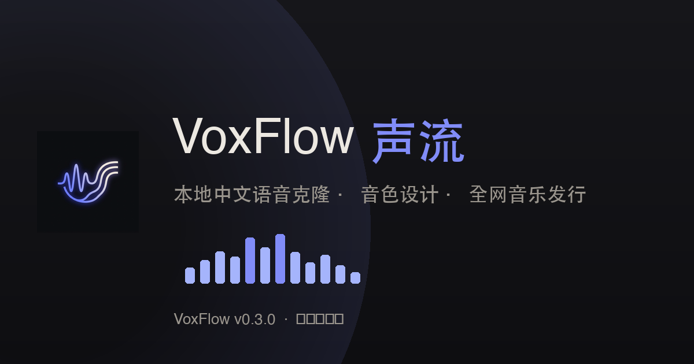

# VoxFlow

A local-first Chinese TTS workstation for creators, AI, and agents. It combines voice cloning, text-guided voice design, multi-speaker dialogue synthesis, Suno music workflows, and release-material packaging in one workspace.

<p align="center">
  
</p>

<p align="center">
  
</p>

## Quick start

```bash
git clone https://github.com/webkubor/voxflow.git
cd voxflow
chmod +x install.sh && ./install.sh
source .venv/bin/activate
voice --help
```

The installer creates `.venv`, installs the Python dependencies, downloads the Base model, and optionally downloads VoiceDesign.

## Requirements

| Requirement | Notes |
| :--- | :--- |
| Platform | macOS on Apple Silicon is the first-class target. The engine falls back to CPU when MPS is unavailable, which is substantially slower. |
| Python | 3.10–3.13. |
| Disk | About 4.2GB for Base-1.7B, plus about 4.2GB for VoiceDesign-1.7B. |
| FFmpeg | Recommended for MP3 reference audio and automatic trimming. Install on macOS with `brew install ffmpeg`. |
| Node.js / npm | Needed only to modify or rebuild the Vue UI: `cd web/ui && npm install && npm run build`. |

For a manual Python setup, or when `voice doctor` reports missing PyTorch packages:

```bash
pip install -e .
pip install modelscope torch torchaudio
```

## Main commands

```bash
voice voice list
voice clone <persona> "Hello from VoxFlow"
voice design <voice_name> "This is a short modeling sentence" --tone "warm, clean, intimate"
voice dialogue configs/dialogue.json
voice doctor
voice web
```

## Current capabilities

| Capability | Status | Entry point |
| :--- | :---: | :--- |
| Voice cloning | Available | `voice clone` or the Clone tab |
| Voice design | Available | `voice design` or the Design tab |
| Multi-speaker dialogue | Available | `voice dialogue <config.json>` or the Dialogue tab |
| Web UI | Available | `voice web` → `http://localhost:8866` |
| Presets and task history | Available | `voice preset` and `voice job` |
| AI script generation / polishing | Optional | Any OpenAI-compatible backend via `VOXFLOW_LLM_*` environment variables |

## Optional AI writing backend

Script generation and polishing use an OpenAI-compatible API. The default is a local FreeLLMAPI endpoint, but any compatible gateway can be selected without code changes:

```bash
export VOXFLOW_LLM_BASE_URL="https://your-gateway.example/v1"
export VOXFLOW_LLM_MODEL="your-model"
```

Inject `VOXFLOW_LLM_API_KEY` through the runtime environment or a secret manager; never write it to a config file or the repository.

Without an LLM backend, the core TTS workflows continue to work normally.

## Next direction

- Make TTS providers configurable: local Qwen3-TTS by default, cloud providers as an option.
- Add high-resolution cover generation and platform-specific release SOPs.
- Verify third-party music distribution services before building further upload automation.

## License

[Apache-2.0](LICENSE)
